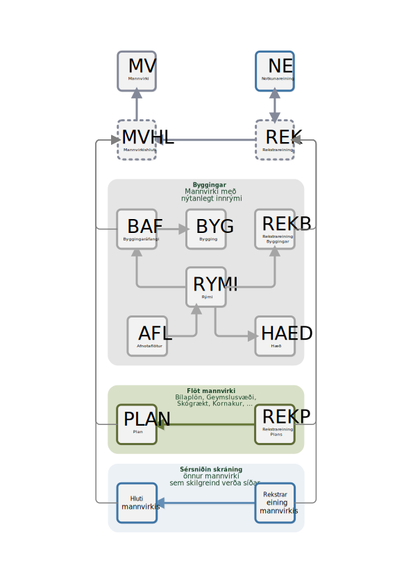

Mannvirkjaskrá 
===============

Mannvirkjaskrá er nýr gagnagrunnur um íslensk mannvirki. 

Húsnæðis- og mannvirkjastofnun heldur utan um nýju mannvirkjaskrána í samstarfi við aðila verkefnisins. Mannvirki hafa hingað til verið skráð í fasteignaskrá Þjóðskrár Íslands en með þessum breytingum verður mannvirkjaskrá nú aðgreind frá öðrum hlutum fasteignaskrárinnar. 

Verkefnið verður unnið í nánu samstarfi ráðuneytanna, Þjóðskrár Íslands, Húsnæðis- og mannvirkjastofnunar og Sambands íslenskra sveitarfélaga. Haghöfum verður auk þess boðið upp á samráð um þróun verkefnisins.

Ráðgert er að ný mannvirkjaskrá verði komin í gagnið 1. júní  2022.

Hugtakalíkan mannvirkjaskrár
----------------------------
Hugtakalíkan mannvirkjaskrár inniheldur skilgreiningar á þeim hugtökum sem notuð eru í mannvirkjaskráningu. Líkanið er afmörkun á viðfangsefni mannvirkjaskrár og lýsing á þeim hlutum sem þar koma fyrir. 

Tilgangur hugtakalíkans er að ná fram sameiginlegum skilningi á milli þeirra aðila sem koma að uppbyggingu mannvirkjaskrár eða annarra aðila sem smíða kerfi sem reiða sig á mannvirkjaskrá. Hugtakalíkanið er undirstaða undir tæknilega útfærslu á mannvirkjaskrá og setur henni skorður.

Staða skjals
---------------
Skjal þetta er í vinnslu og verður uppfært eftir því sem verkefninu um uppbyggingu mannvirkjaskrár miðar áfram. Stefnt er að því að fyrsta útgáfa af hugtakalíkani verið tilbúið 1. október 2021.

Yfirlitsmynd hugtaka
----------------------------

